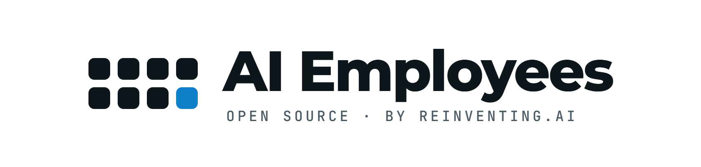
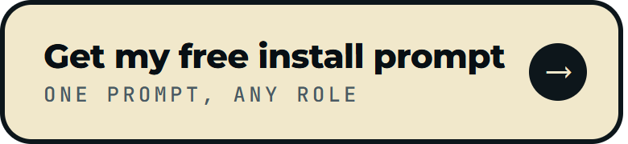
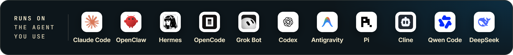

<p align="center">
  <picture>
    <source media="(prefers-color-scheme: dark)" srcset="assets/logo-dark.png">
    
  </picture>
</p>

<h3 align="center">Eight open source AI Employees. Each one runs a whole business role.</h3>
<p align="center">60 scheduled routines. Your own machine. The AI agent you already use.</p>

<p align="center">
  <a href="https://club.reinventing.ai/ai-employees?utm_source=github&utm_medium=readme&utm_campaign=ai-employees&utm_content=nav-employees"><strong>The eight AI Employees</strong></a>
  &nbsp;&bull;&nbsp;
  <a href="https://club.reinventing.ai/?utm_source=github&utm_medium=readme&utm_campaign=ai-employees&utm_content=nav-club"><strong>Agent Ops Club</strong></a>
  &nbsp;&bull;&nbsp;
  <a href="https://club.reinventing.ai/events?utm_source=github&utm_medium=readme&utm_campaign=ai-employees&utm_content=nav-sessions"><strong>Live sessions</strong></a>
  &nbsp;&bull;&nbsp;
  <a href="https://club.reinventing.ai/software?utm_source=github&utm_medium=readme&utm_campaign=ai-employees&utm_content=nav-software"><strong>Software library</strong></a>
  &nbsp;&bull;&nbsp;
  <a href="https://club.reinventing.ai/faq?utm_source=github&utm_medium=readme&utm_campaign=ai-employees&utm_content=nav-faq"><strong>FAQ</strong></a>
</p>

<p align="center">
  
  
  <a href="https://www.npmjs.com/package/ai-employees"></a>
  
  
</p>

<p align="center">
  <a href="https://club.reinventing.ai/pricing?utm_source=github&utm_medium=readme&utm_campaign=ai-employees&utm_content=btn-install-prompt"></a>
  <a href="https://club.reinventing.ai/register?utm_source=github&utm_medium=readme&utm_campaign=ai-employees&utm_content=btn-join"></a>
  <a href="https://club.reinventing.ai/events?utm_source=github&utm_medium=readme&utm_campaign=ai-employees&utm_content=btn-sessions"></a>
  <a href="https://club.reinventing.ai/?utm_source=github&utm_medium=readme&utm_campaign=ai-employees&utm_content=btn-club"></a>
</p>

<p align="center">
  <a href="https://club.reinventing.ai/ai-employees?utm_source=github&utm_medium=readme&utm_campaign=ai-employees&utm_content=harness-strip#install"></a>
</p>

<p align="center">
  ⭐ <em>Found something useful? Star the repo. It takes a second and helps the next person find it.</em>
</p>

## AI Employees

An AI Employee is a folder of scheduled routines that covers one business role. It runs on your own machine, on the AI agent you already use, and briefs you every morning. They drive your browser and your PC the way you do, and every run makes the next one better. Eight roles, every routine and schedule in this repo, nothing held back.

Created by [Mark Fulton](https://www.reinventing.ai/?utm_source=github&utm_medium=readme&utm_campaign=ai-employees) of Reinventing.AI, founder of [Vibe Coding is Life](https://facebook.com/groups/vibecodinglife) (340,000+ members). Running my own business every weekday since August 27, 2026.

## The eight AI Employees

| Employee | What it owns | Routines |
|---|---|---|
| <br>[**GTM Engineer**](https://club.reinventing.ai/ai-employees?utm_source=github&utm_medium=readme&utm_campaign=ai-employees&utm_content=table-gtm-engineer#gtm-engineer) | Your launch: positioning, the launch board, outbound drafts, directory and press forms, the weekly scoreboard | 8 |
| <br>[**SEO/AEO Employee**](https://club.reinventing.ai/ai-employees?utm_source=github&utm_medium=readme&utm_campaign=ai-employees&utm_content=table-seo-employee#seo-employee) | Keyword research, one article a weekday, publishing, indexing, rank review and your visibility in AI answers | 8 |
| <br>[**Web Dev Employee**](https://club.reinventing.ai/ai-employees?utm_source=github&utm_medium=readme&utm_campaign=ai-employees&utm_content=table-web-dev-employee#web-dev-employee) | Site health, error triage, small changes on a branch, dependency review | 8 |
| <br>[**Social Media Employee**](https://club.reinventing.ai/ai-employees?utm_source=github&utm_medium=readme&utm_campaign=ai-employees&utm_content=table-social-media-employee#social-media-employee) | Posts drafted in your voice for each platform, a veto window, replies drafted for you | 7 |
| <br>[**Ad Manager Employee**](https://club.reinventing.ai/ai-employees?utm_source=github&utm_medium=readme&utm_campaign=ai-employees&utm_content=table-ad-manager-employee#ad-manager-employee) | Account reads, creative sets, build sheets and the weekly change list. Money moves only when you approve | 7 |
| <br>[**Sales Employee**](https://club.reinventing.ai/ai-employees?utm_source=github&utm_medium=readme&utm_campaign=ai-employees&utm_content=table-sales-employee#sales-employee) | Prospect sweeps, first touches into your own drafts, follow ups that never go quiet | 7 |
| <br>[**Customer Satisfaction Employee**](https://club.reinventing.ai/ai-employees?utm_source=github&utm_medium=readme&utm_campaign=ai-employees&utm_content=table-customer-satisfaction-employee#customer-satisfaction-employee) | Inbox sweep, replies drafted hardest first, churn flags with evidence | 8 |
| <br>[**Chief of Staff**](https://club.reinventing.ai/ai-employees?utm_source=github&utm_medium=readme&utm_campaign=ai-employees&utm_content=table-chief-of-staff#chief-of-staff) | Reads every other employee's run log, names what quietly stopped, brings you three moves | 7 |

Sixty routines. Every kit, with its full schedule and a sample of its output, is in [employees/](employees).

## Install in two steps

**1. Download a kit and extract it to your PC.** Click **Code, Download ZIP** above, or run `npx ai-employees hire gtm-engineer --to <folder>`. Any folder not inside OneDrive, Dropbox, Google Drive or iCloud.

**2. Open your agent in that folder and say "Install the GTM Engineer from this folder."** It researches your business from your website, builds your dashboard, schedules its own routines, and stops once to show you its first drafts.

You need an AI agent you are logged in to (Claude Code is what I use) and a browser signed in to the accounts it should read. [Prerequisites](docs/PREREQUISITES.md). [Full install guide](docs/INSTALL.md).

**Not on Claude Code?** The same two steps work on OpenClaw, Hermes, OpenCode, Grok Bot, Codex, Antigravity, Pi, Cline, Qwen Code and DeepSeek. [docs/HARNESSES.md](docs/HARNESSES.md) has the command for each.

<table>
<tr><td align="center" width="900">

<h2>Get your install prompt and a guided first hire, free</h2>

<p>Hiring one or all eight, pick your roles in the Agent Ops Club and copy one prompt your agent runs from start to finish. The Hire Your First AI Employee walkthrough takes you through it step by step.</p>

<a href="https://club.reinventing.ai/pricing?utm_source=github&utm_medium=readme&utm_campaign=install-prompt"></a>

<p><sub><b>Free account, no card.</b></sub></p>

</td></tr>
</table>

## What sets these AI Employees apart

- **They get better at your business every run.** When a page changes, the routine fixes its own instructions and tells you in the next brief.
- **They drive your browser and your PC the way you do.** Signed in as you, on your own machine, from techniques learned on real runs.
- **You set how far they go.** Everything is drafted, filled and staged, and the last click is yours until you release a channel.
- **One brief each morning.** One push to your phone, only when you are the blocker.
- **They run on the agent you already use.** Claude Code and ten others, without a routine changing by one word.
- **You can direct any of them in chat.** Open a session in the employee's folder and tell it what to do.
- **Upgrades never overwrite your work.** `npx ai-employees upgrade` leaves every file you edited alone.

[The long version](docs/WHAT-SETS-THEM-APART.md).

## What a morning looks like

The brief the GTM Engineer leaves, from a fictional business, Northwind Roofing. Yours has your cards in it.

```
# 2026-03-05

## Today
- C-007 | Stage the storm season email for segment-1 | queue/2026-03-05-email.md
- C-011 | Fill the local trades directory listing and leave the tab open | queue/2026-03-05-form.md
- C-012 | Verify the quote request conversion event fires on the thank you page | paid/conversion-quote-request.md

## Waiting on you
- queue/2026-03-05-email.md: three drafts, none ticked
- C-009 | Submit the supplier co-marketing listing | filled in its tab, the submit is yours

## Blocked
- gtm-signal-sweep, open since 2026-02-26: the review platform asked for a sign in, nothing entered
```

[The full brief](employees/gtm-engineer/examples/brief-latest.md), with the run log and the ledgers beside it.

## How an AI Employee runs

A folder of plain text files you can open and change. Nothing runs anywhere else.

```
gtm-engineer/
  INSTALL-PROMPT.md        what your agent reads to set itself up, once
  ROLE.md                  who this employee is and how it thinks
  SCHEDULE.md              when each routine runs
  RELEASES.md              yours: the channels you have released, shipped empty
  routines/<id>/SKILL.md   one folder per routine
```

Each routine runs at its time, inside a window. If your machine was asleep and the job fires late or twice, it sees the work is done and does nothing.

Two guardrails. Shipped, every send, post, submit, publish and spend is held for your click, and `RELEASES.md` is where you hand a channel over. No AI Employee ever creates an account, enters a password, completes a captcha or accepts terms.

[How employees work](docs/HOW-EMPLOYEES-WORK.md). [The guardrails, routine by routine](docs/GUARDRAILS.md).

## What AI Employees cost to run

On a Claude Pro or Max plan, nothing beyond the plan. They spend a share of your plan's usage limits, not dollars. Measured on my own Max seat, the GTM Engineer's scheduled runs were about 6 percent of everything the machine sent to Claude. [docs/COST.md](docs/COST.md) has the method, the per routine table and the API key reference.

## Go further

The eight are free for good. The Agent Ops Masterclass, the premium software library with a resale license, the live sessions and, from October, premium AI Employees live in the [Agent Ops Club](https://club.reinventing.ai/?utm_source=github&utm_medium=readme&utm_campaign=ai-employees). A free club account gets you the session calendar, the walkthrough lesson with the launch replay, the preview lessons and AI Employee updates.

## FAQ

**Does it send anything?** By default, no. It drafts, fills and stages, and you press the button. **Windows, Mac or Linux?** All three. **Can I run just one?** Yes, each is a self contained folder. **Can I sell installs to clients?** Yes, it is MIT; just do not call yours by the club's name. The rest is in [docs/FAQ.md](docs/FAQ.md).

## Contributing

Routine requests, new employee proposals, harness reports and corrections from real runs are all welcome. Post what an employee did for your business in Discussions under Show and tell. [CONTRIBUTING.md](CONTRIBUTING.md) has the rules.

## License

MIT. Copyright (c) 2026 Mark Fulton. [LICENSE](LICENSE). Names and logos are not licensed, and forks get their own name: [TRADEMARKS.md](TRADEMARKS.md).

Built by Mark Fulton with Claude Code. Every contributor is in [CREDITS.md](CREDITS.md). Report a way to make an employee send or spend through [SECURITY.md](SECURITY.md), not a public issue.
