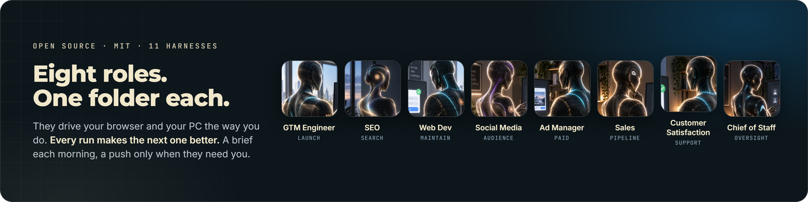

<div align="center">

# AI Employees

**Eight open source AI Employees. Each one runs a whole business role on a schedule, on your own machine, on the agent you already use.**

59 scheduled routines. 11 harnesses. Windows, macOS and Linux. They drive your browser and your PC the way you do, and every run makes the next one better. Running my own business every weekday since August 27, 2026.

[](https://claude.com/claude-code)
[](LICENSE)
[](docs/HARNESSES.md)
[](docs/INSTALL.md)
[](CONTRIBUTING.md)
[](https://www.npmjs.com/package/ai-employees)

**Created by [Mark Fulton](https://www.reinventing.ai/?utm_source=github&utm_medium=readme&utm_campaign=ai-employees), Reinventing.AI.** Founder of [Vibe Coding is Life](https://facebook.com/groups/vibecodinglife) (330,000+ members)

</div>

<a href="https://club.reinventing.ai/ai-employees?utm_source=github&utm_medium=readme&utm_campaign=ai-employees"></a>

The GTM Engineer has run my club launch every weekday since August 27. The other seven are built to the same standard and I am running them on my own business from launch day, in public.

Not chat assistants. Scheduled jobs that cover a whole role, run on your own machine, and brief you every morning. Every routine, every schedule, every install prompt is in this repo. Nothing is held back.

Compare them with anything else you can install today. I think these are **the world's best AI Employees**, and this repo is all the evidence you need to decide.

<table>
<tr><td align="center" width="900">

<h2>Get the full guides and your custom AI Employee install prompt</h2>

<p><b>Every kit here ships its own INSTALL-PROMPT.md. Your club dashboard writes you one.</b></p>

<p>Tick the roles you want and it composes one prompt for your agent: the fetch command for each kit, every kick off prompt in order, and the guardrails. A guide per AI Employee and the guided walkthrough sit beside it.</p>

<a href="https://club.reinventing.ai/members/hire?utm_source=github&utm_medium=readme&utm_campaign=install-prompt"></a>

<p><sub><b>Free account, no card,</b> at club.reinventing.ai.</sub></p>

</td></tr>
</table>

## What sets these AI Employees apart

- **They improve their own routines.** Recursive self improvement is built into every kit. A moved selector, a changed confirmation string or a step that now needs a scroll is repaired in the run that hit it. A lesson that would otherwise repeat is written into the routine's own `SKILL.md`, surgically, with the full replaced text logged to `improvements/CHANGELOG.md` as the undo. The next morning's brief says what changed under "What changed about me". No invented approval gate: your harness already asks before anything writes to your disk, and that is the right place for it.
- **One push to your phone, only when you are the blocker.** A session expired on a surface a routine needs, a credential is missing, the conversion event stopped firing while paid spend is live, or a browser lock is held by a run that died. Four cases and no fifth. One line under 200 characters with no draft text, no name and no credential fragment in it, because it lands on a lock screen. Never twice for the same blocker, never outside your working hours, never on a first run. Everything else stays in the brief. [The one push](docs/STANDARD.md#23-the-one-push).
- **PC and browser use, trained by hand.** Every browser routine runs on `recipes/BROWSER-RECIPES.md`, a technique library written from real runs on my own machine rather than from documentation: click what the page actually rendered, verify by reading the page back, compress an image before it goes in, stage a filled form and leave the tab open on the last step. The per site flow files are learned on your machine the first time a routine needs one and repaired every time after. The browser lane locks per platform so two routines never crawl the same signed in account at once, and on LinkedIn it reads and never clicks.
- **Capabilities, never tools.** Routine bodies say `page.read` and `notify.push`. One file per kit maps each capability to a concrete route on your harness. That is why one kit runs on Claude Code, OpenClaw, Hermes, OpenCode, Grok Bot, Codex, Antigravity, Pi, Cline, Qwen Code and DeepSeek without a routine changing by one word.
- **A published standard and a safe upgrade path.** Every kit implements the [Agent Employee Standard](docs/STANDARD.md), ships an `employee.json` manifest, and upgrades with `npx ai-employees upgrade`, which reports first, never overwrites a file you edited, and never reads your ledgers, strategy or learned flows. `npx ai-employees contribute` turns the repairs a kit made to itself into a field report you can open upstream.
- **You can direct any of them in chat.** Open an interactive session in the kit folder and it may do anything you may do by hand, on your word: tick a card you confirmed, stage a form now, retune a strategy file, correct a stale brief. It leaves the same trail a routine would, and the scheduled runs treat its work as yours.
- **Windows, not fire times.** Every routine checks a window and a period key before it reads a single document, so a late fire, a duplicate fire or a machine that woke up an hour late is harmless on every scheduler.
- **Your harness's permission layer is the gate, and you set it.** Scheduled routines draft, fill, stage and brief by default; sending, publishing and spending happen on the channels you release in `RELEASES.md`, the ones you configure, or on your word, and the permission mode you give each task is the scope it has. The kit is yours to widen: the guard script, the contract and every routine are plain files in your own folder. `scripts/guard.mjs` runs in front of every routine to check the window and the period key, with a self test you can run before you trust it.

## The eight AI Employees

| Employee | Role | What it owns | Routines | Cadence | Folder |
|---|---|---|---|---|---|
| <br>**GTM Engineer** | Go to market and launch | The growth hire who would own your entire launch: ICP, positioning, the launch board, outbound drafts, directory and press forms, paid setup, the weekly scoreboard | 8 | 4 weekday, 2 weekly, 2 monthly | [employees/gtm-engineer](employees/gtm-engineer) |
| <br>**SEO Employee** | Search and content | A content marketer plus the SEO retainer: keyword research, one article a weekday, publishing to properties with no API, indexing, rank review, the calendar | 7 | 3 weekday, 3 weekly, 1 monthly | [employees/seo-employee](employees/seo-employee) |
| <br>**Web Dev Employee** | Engineering and maintenance | The monthly maintenance retainer and the ticket queue: site health, error triage, small changes on a branch, dependency review, platform drift | 8 | 3 weekday, 3 weekly, 2 monthly | [employees/web-dev-employee](employees/web-dev-employee) |
| <br>**Social Media Employee** | Audience and distribution | The social manager you keep meaning to hire: material sweep, platform native drafts in your voice, a veto window, engagement replies drafted never sent | 7 | 5 weekday, 1 weekly, 1 monthly | [employees/social-media-employee](employees/social-media-employee) |
| <br>**Ad Manager Employee** | Paid acquisition | The percentage of spend agency, for the cadence work: account reads, creative sets, build sheets, the weekly change list. Money moves only when you approve | 7 | 4 weekday, 1 weekly, 2 monthly | [employees/ad-manager-employee](employees/ad-manager-employee) |
| <br>**Sales Employee** | Pipeline and outreach | The SDR you cannot justify hiring yet: prospect sweeps, first touches into your own drafts, follow ups that never go quiet, the pipeline review | 7 | 4 weekday, 1 weekly, 2 monthly | [employees/sales-employee](employees/sales-employee) |
| <br>**Customer Satisfaction Employee** | Support and retention | The support lead role, before you can afford one: inbox sweep, replies drafted hardest first, churn flags with evidence, the one product change that removes the most tickets | 8 | 4 weekday, 2 weekly, 2 monthly | [employees/customer-satisfaction-employee](employees/customer-satisfaction-employee) |
| <br>**Chief of Staff** | Oversight and strategy | The operator who would run your week: reads every other employee's run log, names what quietly stopped, and argues against its own top recommendation | 7 | 2 weekday, 3 weekly, 2 monthly | [employees/chief-of-staff](employees/chief-of-staff) |

Fifty nine routines. Every one has an id that is its folder name, its YAML `name`, and the name of its scheduled job, always the same string.

## Quick start: hire your first AI Employee

Read [docs/PREREQUISITES.md](docs/PREREQUISITES.md) first. It is ten items, and the one that fails silently is the login.

**Path A, the installer.** Copies one AI Employee to a folder outside cloud sync, runs its self tests, and prints its install prompt with the path filled in.

```
npx ai-employees hire gtm-engineer --to D:\AgentOps\gtm-engineer
```

**Path B, a clone.** Copy `employees/gtm-engineer` to a folder outside OneDrive, Dropbox, Google Drive or iCloud, open a session there in the harness you use, and paste `INSTALL-PROMPT.md`.

Either way: you spend about ten minutes answering questions. The AI Employee's first run takes about an hour and may ask for a second session. It researches your business from your own public pages instead of interviewing you, writes your strategy files, builds your dashboard, registers its own schedule, and stops exactly once to show you its first drafts. [docs/INSTALL.md](docs/INSTALL.md) is the long version, per operating system and per scheduler.

Built for Claude Code, OpenClaw, Hermes, OpenCode, Grok Bot, Codex, Antigravity, Pi, Cline, Qwen Code and DeepSeek, and runs on Windows, macOS and Linux. Claude Code on Windows is where the GTM Engineer runs my own club launch every weekday. OpenClaw, Hermes, Cline and Qwen Code have built in cron or scheduled tasks, Codex has scheduled runs, Antigravity has the `agy` job runner, DeepSeek schedules through a plugin, OpenCode and Pi use the operating system's scheduler, and Grok Bot runs from its own cloud computer. [docs/HARNESSES.md](docs/HARNESSES.md) has the invocation and the first run check for each.

<details>
<summary>OpenClaw</summary>

Reads the same `SKILL.md` format. Register each routine's schedule as an OpenClaw automation pointed at the kit's `routines/` folder: `openclaw automations create "<cron>" "Read <root>/routines/<id>/SKILL.md and follow it." --name <id> --session isolated`, one per routine, with the timezone flag. Probe its browser control first: the kit never signs in, so a clean browser means every read of your own accounts lands on a login wall. [docs/HARNESSES.md](docs/HARNESSES.md).
</details>

<details>
<summary>Hermes</summary>

Point its built in cron at the kit's `routines/` folder and mirror the cadence in `SCHEDULE.md`, one job per routine, each handed that routine's `SKILL.md` as the prompt. Confirm it reads files and runs a shell command; then the file routines work and the browser question decides the rest.
</details>

<details>
<summary>OpenCode</summary>

Reads the Claude Code skill format directly. No scheduler of its own: mirror `SCHEDULE.md` into the operating system's scheduler with `opencode run "Read <root>/routines/<id>/SKILL.md and follow it."`, one job per routine. Add a browser automation server for the browser lane.
</details>

<details>
<summary>Grok Bot</summary>

Its bots already run routines on a schedule from their own cloud computer. Create one recurring task per routine and hand it that routine's `SKILL.md` as the run prompt. Whether it can reach your own signed in accounts is the thing to check first, because it runs somewhere else.
</details>

<details>
<summary>Codex</summary>

Drive the cadence with scheduled runs, one per routine, each `codex exec "Read <root>/routines/<id>/SKILL.md and follow it."`. Confirm the sandbox can write inside the kit folder and reach the network before you trust a run.
</details>

<details>
<summary>Antigravity</summary>

Schedule each routine with the `agy` job runner pointed at the routine folder rather than registered as a global pack: `agy -p "Read <root>/routines/<id>/SKILL.md and follow it."`. Settle whether it drives the browser profile you are signed in to or a clean one.
</details>

<details>
<summary>Pi</summary>

Reads skills folders directly and runs headless with `pi -p "Read <root>/routines/<id>/SKILL.md and follow it."`. No scheduler of its own: mirror `SCHEDULE.md` into the operating system's scheduler, one job per routine, with the kit folder as the working directory. Confirm the print flag against `pi --help`, then settle the browser question.
</details>

<details>
<summary>Cline</summary>

The Cline CLI has its own cron: `cline schedule create "Read <root>/routines/<id>/SKILL.md and follow it." --cron "<cron>"`, one per routine, run with auto approve on so a scheduled run never hangs on a prompt. Confirm the flags against `cline --help`. Check that a scheduled run starts in the kit folder before you trust it.
</details>

<details>
<summary>Qwen Code</summary>

Reads the skill format and ships scheduled tasks. Register one per routine, or drive `qwen -p "Read <root>/routines/<id>/SKILL.md and follow it."` from the operating system's scheduler. Confirm the print flag against `qwen --help`, and confirm it can write inside the kit folder and reach the network.
</details>

<details>
<summary>DeepSeek</summary>

`dsh` runs a local server with a web interface, and scheduling is one of its plugins. Register one scheduled run per routine, handed that routine's `SKILL.md` as the prompt, with the kit folder as the working directory. Confirm the headless prompt form against `dsh --help`, then settle whether it drives your signed in browser profile or a clean one.
</details>

A free club account gets the guided Hire Your First AI Employee walkthrough with the launch replay, the session calendar, the preview lessons and AI Employee updates: [club.reinventing.ai](https://club.reinventing.ai/?utm_source=github&utm_medium=readme&utm_campaign=ai-employees).

## What an AI Employee is

A folder. Seven documents and a `routines/` directory, and nothing runs anywhere else.

```
gtm-engineer/
  CONTRACT.md          the spine: who writes which file, the guards, the two guardrails
  ROLE.md              who this employee is and how it thinks
  RELEASES.md          yours: the channels you have released, shipped empty
  CAPABILITIES.md      capability to route, per harness, honest about what was confirmed
  SCHEDULE.md          the only file that carries a cadence, a fire time, a window, or a budget
  INSTALL-PROMPT.md    the one prompt you paste, once
  routines/<id>/SKILL.md   one folder per routine
  scripts/             guard.mjs, runlog.mjs, copy-check.mjs, each with a --selftest
  run/                 one Windows launcher example per routine
```

**Windows, not fire times.** Every routine has a fire time you register and a window it checks. Outside the window it records a skip and exits. A period key (the local date, the ISO week, or the month) makes sure the work happens once however many times the job fires. That is what makes a late or duplicated fire harmless, on every scheduler.

**Scheduled jobs, not skills.** A skill is invoked on demand. A routine is fired at a time, in a folder, inside a window. Point your scheduler at the kit's `routines/` folder and never copy them into a global skills directory; they carry `metadata: internal: true` so registries do not list them. The only on demand skill in this repo is [`hire`](skills/hire/SKILL.md).

**No Sunday.** A Sunday belongs to the ISO week that just ended, so a weekly routine there would share a period key with the following week and one of the two runs would be lost with no error.

**Glossary:** member: the person who owns this Employee. The kits say "the member" throughout; read it as you. The «guillemets» are placeholders the install fills in. [docs/HOW-EMPLOYEES-WORK.md](docs/HOW-EMPLOYEES-WORK.md) is the whole model, including the five laws every kit is built to.

## Two guardrails, and what each routine does

**The first guardrail is on outbound actions, and it is yours.** Every AI Employee can send, post, submit, publish and spend. Shipped, every one of those is held: the draft is written, the form is filled and left open on the last step, the campaign arrives as a build sheet, and the last click is yours. `RELEASES.md` in the employee's folder is where you hand a channel over, one row at a time, with your conditions on it. From then on the routine that stages that channel completes the action itself and tells you in the morning brief what went out. Two of the eight ship with a channel already yours to configure: the SEO Employee publishes articles to the blog you name, and the Social Media Employee hands drafted posts to the channel you connect, after a veto window in the brief.

**The second guardrail is on credentials, and it stays on.** No AI Employee creates an account, enters or generates a password, completes a captcha, accepts terms, or writes a credential into any file. It never needs your password to do its job, so there is nothing to release.

| Routine kind | Reads | Writes | Leaves for you | Holds, unless you release it |
|---|---|---|---|---|
| The standup, every weekday | Every ledger, run record and tick since yesterday | The board and the thirty line brief | The brief, first thing | Uses a browser |
| Sweeps (signals, prospects, inbox, site health, material, market) | Your own signed in pages and public pages | Dated, sourced ledger lines | Nothing to do; the drafts come from these | Types into a page, replies, marks anything read |
| Drafting (outreach, replies, posts, articles, creative) | The ledgers, your strategy files, your proof inventory | Queue files, unsent mailbox drafts, article drafts, creative sets | The drafts, to edit and send | Sends, posts, submits, or uses a number not in your proof inventory |
| Form filling (directories, press, listings) | The card and your strategy files | The queue entry with every field's value | The tab, filled, on the last step | Clicks Submit, Publish, Post, Send, Activate, Enable, or Create account |
| Account reads (ads, billing, analytics, registrar, host) | Read screens in accounts you are signed in to | Metrics ledgers, drift findings, build sheets | Every change as a paste ready line with the screen named | Changes a setting, saves a draft in an account that can spend |
| Weekly reviews and monthly refreshes | A week or a month of the kit's own ledgers | The scoreboard with a source beside every number, rewritten strategy where evidence disagrees | One kill and one scale, as cards | Estimates a number it did not measure |
| The Chief of Staff | Every other AI Employee's run log, read only | The fleet page, the fault dossier, the decision brief | Three moves, argued both ways | Writes into another AI Employee's folder |

Everything the employee decides on its own lands as one dated line in a changelog you can read in a minute. Everything it learns about your sites lands in a recipe file inside its own folder. When it gets something wrong, one dated line in that file's `## Corrections` section outranks the file from the next run on.

## Example output

From a fictional business, Northwind Roofing, on a baseline week. The real ones look like this with your cards in them. Every AI Employee folder has an `examples/` directory with a brief, a run log and the ledgers the first run creates.

```
# 2026-03-05

## Today
- C-007 | Stage the storm season email for segment-1 | queue/2026-03-05-email.md
- C-011 | Fill the local trades directory listing and leave the tab open | queue/2026-03-05-form.md
- C-012 | Verify the quote request conversion event fires on the thank you page | paid/conversion-quote-request.md

## Waiting on you
- queue/2026-03-05-email.md: three drafts, none ticked
- queue/2026-03-04-dm.md: two drafts, one ticked
- C-009 | Submit the supplier co-marketing listing | filled in its tab, the submit is yours
- Assumption: working hours weekdays, seven to five local, read from the contact page; correct it in strategy/offer.md
- Strategy change: segment-3, property managers, gained a gathering place from the sweep, strategy/CHANGELOG.md

## Blocked
- gtm-signal-sweep, open since 2026-02-26: the review platform asked for a sign in, nothing entered
- one more open blocker, listed in gtm-latest.md

Guided version, updates and premium employees: club.reinventing.ai
```

[employees/gtm-engineer/examples/brief-latest.md](employees/gtm-engineer/examples/brief-latest.md), with the run log and the ledgers beside it.

## What AI Employees cost to run

- **On a Claude Pro or Max plan, nothing beyond the plan.** The AI Employees run inside Claude Code on your own seat, which is also what the browser lane needs. They spend a share of your plan's usage limits, not dollars.
- **How big a share, measured on one employee as the example:** over ten days on my own Max seat, the GTM Engineer's scheduled runs were about 6 percent of everything this machine sent to Claude, and the rest was me working in Claude Code all day. One AI Employee is a small slice of one seat, and by that measure a seat carries several of them alongside a working day. Anthropic publishes no quota per plan, so that is my machine, not a promise about yours.
- **On an API key, for reference only:** about $19 of Opus 5 usage at list price on a plain weekday, about $27 on Monday and Friday, measured over 27 scheduled runs. Two thirds of that is cache reads, because every turn re-reads the kit's documents. An API key also loses the browser lane, so it is the expensive way to run these, not the normal one.
- The runs behind these numbers used `claude-opus-5` with the 1M context window. [docs/COST.md](docs/COST.md) has the per routine table, the dates and the method.

## Before first run

- **Nothing to fill in.** The install researches your offer, your buyer and your positioning from your own public pages and confirms a short list with you. Three lines at the top of the install prompt: your folder, your home page, and an optional line for anything off limits.
- **A browser signed in** to the accounts the employee should read, and your mailbox if you want drafts landing there. Log in yourself; it never will.
- **Real customer words, if you have any.** Real quotes are the only social proof the routines are allowed to use. With none, they write copy with no social proof rather than inventing any.
- **Your ceilings.** A paid ceiling of zero puts the guard into observation only. Which channels are off limits, and any claim that must never be made, one line each.
- **A machine that is awake** at the fire times in `SCHEDULE.md`, or fire times moved to after it normally wakes.

## AI Employee of the Week

One AI Employee at a time, with a real output from a real run on my own business. The series lives at [docs/EMPLOYEE-OF-THE-WEEK.md](docs/EMPLOYEE-OF-THE-WEEK.md). Community entries from Discussions go there too, with your name on them.

## Contributing

Routine requests, AI Employee proposals, harness reports, translations, and corrections from real runs. Post what an employee did for your business in Discussions under Show and tell; good builds go into the README with your name on them. [CONTRIBUTING.md](CONTRIBUTING.md) has the rules: MIT in and out, a DCO sign off on every commit, no em or en dash anywhere, and the drafting defaults are not negotiable in a shipped routine.

Issues are answered within a working day for the first month; after that, Discussions is where the community answers and I read every thread.

## Go further

The eight are free for good. The Agent Ops Masterclass, the premium software library with a resale license, the live sessions and, from October, premium AI Employees live in the [Agent Ops Club](https://club.reinventing.ai/?utm_source=github&utm_medium=readme&utm_campaign=ai-employees). A free club account gets you the session calendar, the walkthrough lesson with the launch replay, the preview lessons and AI Employee updates.

## FAQ

**Does it send anything?** By default, no: drafts, filled forms, build sheets, and you press the button. Where you configured a channel, authorized it in a session, or widened the task's permission, yes. **Windows, Mac or Linux?** All three; the install page has the scheduler steps for each. **Can I run just one?** Yes; each is a self contained folder. **What if my machine is asleep?** The Desktop app and Task Scheduler run one late catch up, launchd folds missed fires into one, cron skips; the window makes any of that safe. **Can I sell installs to clients?** Yes, it is MIT; just do not call yours by the club's name. The rest is in [docs/FAQ.md](docs/FAQ.md).

## License

MIT. Copyright (c) 2026 Mark Fulton. [LICENSE](LICENSE).

## Trademarks

Names and logos are not licensed. "Reinventing.AI" and "Agent Ops Club" are claimed as marks; "AI Employees" and the role names are descriptive and free to use. Forks get their own name. [TRADEMARKS.md](TRADEMARKS.md).

## Credits

Built by Mark Fulton with Claude Code. Every contributor is in [CREDITS.md](CREDITS.md) and in the git history. Report a way to make an employee send or spend through [SECURITY.md](SECURITY.md), not a public issue.
